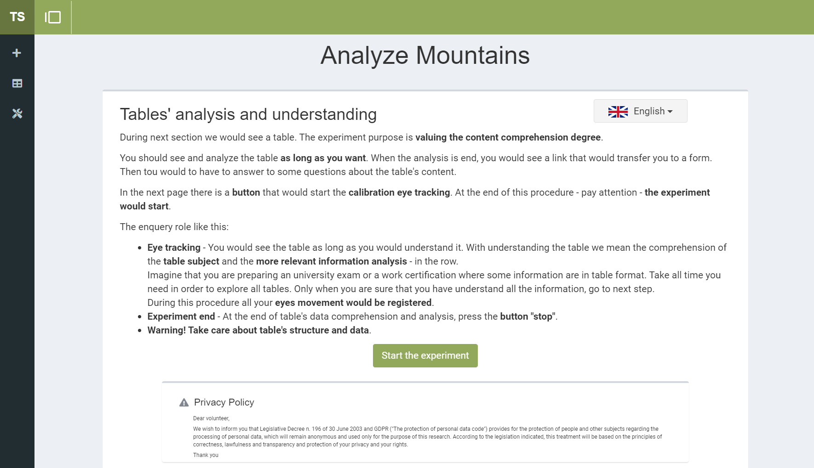

# Table Summarisation

Table Summarisation is a tool, starting from the semantic annotations of the table content, can elaborate natural
language summaries that meet the user's cognitive needs and adapt the way they would have expectedly analyzed the data.
The tool, using semantic annotations, builds RDF triples that can be used to generate a text in natural language through
a Neural Machine Translation approach.
The selection of the RDF triples and the generation of the sentences are made concerning the end-user's information need.
Table Summarisation is developed using [Diango](https://www.djangoproject.com/) v2.2.8.

## Features

- Display and management of tabular data
- Eye movement tracking system to identify the most interesting information for the user
- Natural language summary generation process

## Dependences

The framework is tested to work on Python v3.x and Node.js v14.x.

The required dependencies are:
djongo[json]==1.2.38, django==2.2.8, jsonfield==2.1.1, celery[redis]==4.4.2, nltk, geopy, pycountry

## Repository structure

    [projectname]/
    ├── app/                <- Django root
    │   ├── __init__.py
    │   ├── celery.py       <- Celery settings
    │   ├── settings.py     <- Django settings
    │   ├── urls.py         <- Django urls configurations
    │   └── wsgi.py
    ├── tablesummarisation/
    │   ├── migrations      <- database migrations
    │   ├── private         <- files used in the application (e.g. list of currencies)
    │   ├── process         <- classes for lexicalisation process
    │   ├── static          <- static assets (e.g. css, js, img)
    │   ├── templates       <- templates (html)
    │   │   ├── experiments <- templates for eye tracking and questionnaries
    │   │   └── tables      <- templates for lexicalisation process
    │   ├── admin.py        <- Django admin settings
    │   ├── form.py         <- classes for forms
    │   ├── models.py       <- list of models
    │   ├── urls.py         <- urls configurations
    │   └── views.py        <- list of views
    ├── ngix/               <- ngix settings for docker-compose
    ├── NMTmodel/           <- folder for NMT model
    ├── node_modules/       <- requirements for frontend
    ├── paper/              <- files for testing and reproducibility
    ├── docker-compose.yml  <- docker-compose configuration
    ├── Dockerfile
    ├── manage.py
    ├── package.json        <- list of requirements for the frontend
    └── requirements.txt    <- list of requirements for the application

## Getting Started

These instructions will get you a copy of the project up and running on your local machine.

### Installation

Table Summarisation requires [Python](https://www.python.org/) v3.x and [Node.js](https://nodejs.org/) v14.x to run.

Install the dependencies.

```sh
pip3 install --no-cache-dir -r requirements.txt
```

Install the dependencies for the frontend.

```sh
npm install
```

Serve the static files of the frontend.

```sh
python3 manage.py collectstatic --noinput
```

Generate and migrate database.

```sh
python3 manage.py makemigrations && python3 manage.py migrate
```

Run server on port 8005 (it is possible to change the port).

```sh
python3 manage.py runserver 0.0.0.0:8005
```

### Docker

Table Summarisation is very easy to install and deploy in a Docker container.

The Docker will expose port 8005, so change this within the Dockerfile if necessary. When ready, simply use
the docker-compose to build the image.

```sh
docker-compose up
```

Verify the deployment by navigating to your server address in your preferred browser.

```sh
0.0.0.0:8005
```

## Screenshot




## OpenNMT Training

```sh
onmt_build_vocab -config model.yaml 

onmt_train -config model.yaml
```


## License

This project is licensed under the Apache License - see the [LICENSE](LICENSE) file for details

**Free Software, Hell Yeah!**